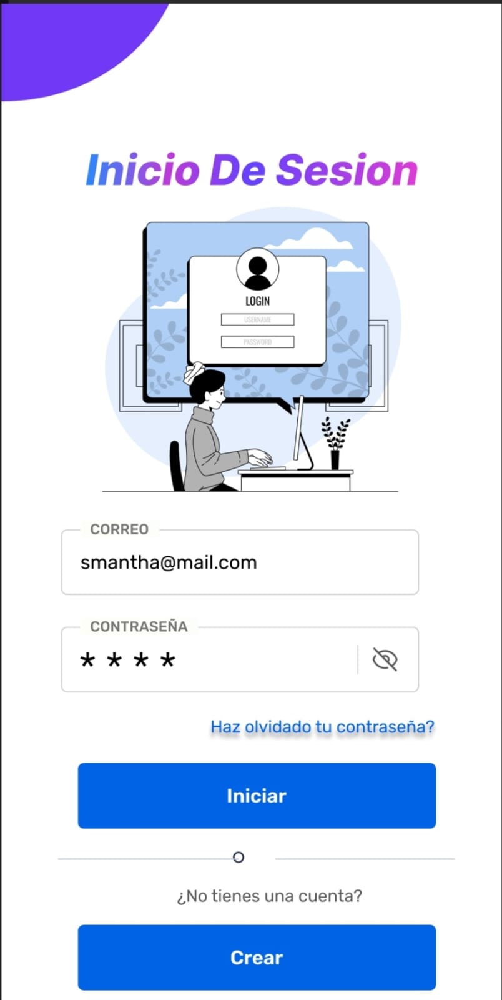
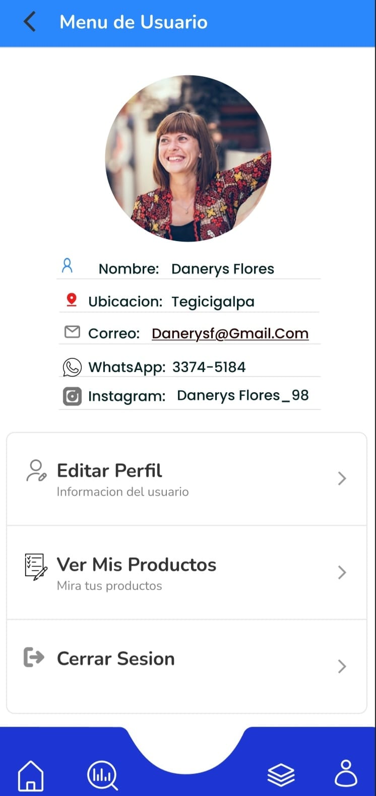
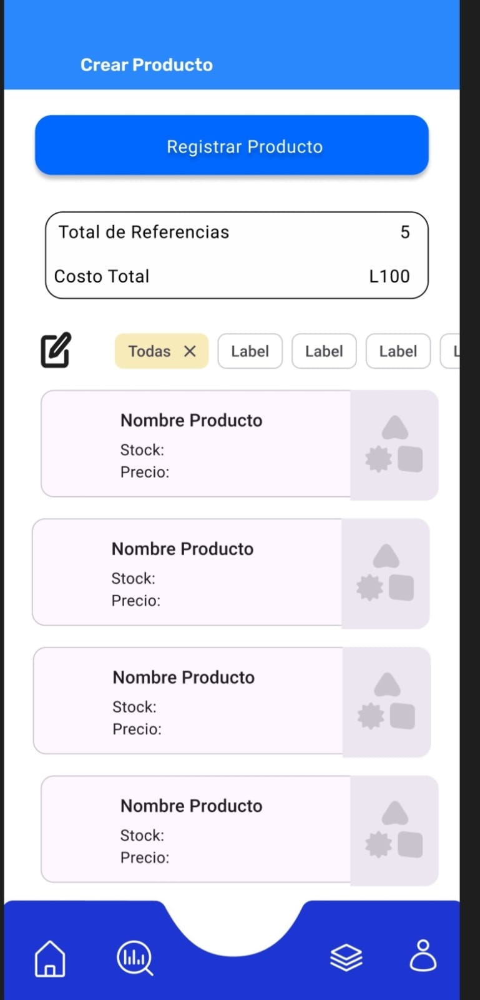
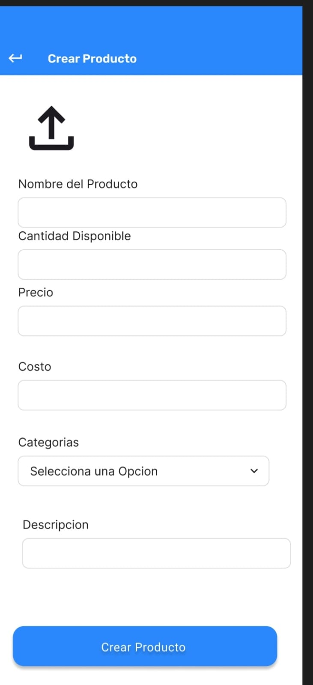
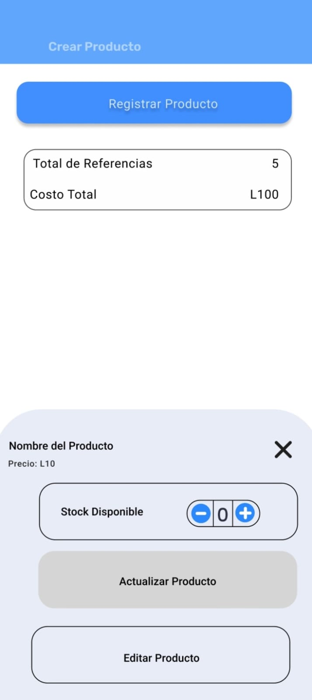
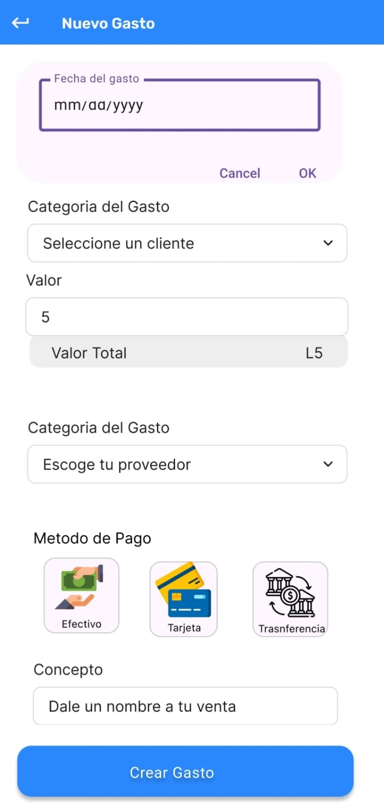
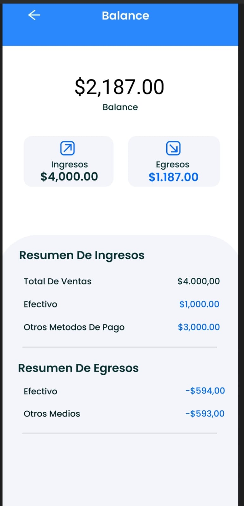

# Miki App - Inventarios y Gestión de Gastos 🚀

Miki App es una aplicación móvil desarrollada en **Flutter** orientada a la administración de pequeños negocios. Permite centralizar el control de stock, registrar movimientos financieros y visualizar balances en tiempo real.

---

## 📸 Pantallas del Proyecto

### Gestión de Acceso
| Inicio de Sesión | Menú de Usuario |
| :---: | :---: |
|  |  |

### Control de Inventarios
| Listado de Productos | Registro | Edición y Stock |
| :---: | :---: | :---: |
|  |  |  |

### Finanzas y Gastos
| Formulario de Gastos | Confirmación | Balance General |
| :---: | :---: | :---: |
|  |  |  |

---

## 🚀 Características Principales
* **Gestión de Stock:** Visualización de referencias y costos totales.
* **Registro de Flujo:** Categorización de gastos por proveedor y cliente.
* **Multimedios:** Soporte para carga de imágenes de productos.
* **Balances:** Resumen detallado de ingresos (Efectivo/Otros) vs Egresos.

## ⚙️ Configuración

1. **Dependencias:** `flutter pub get`
2. **Ejecución:** `flutter run`

---
*Para ver la hoja de ruta de mejoras técnicas, consulta el archivo [TODO.md](./TODO.md).*
